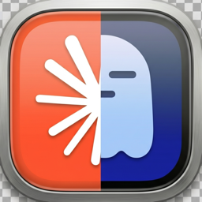

# clautty

Ghostty split launcher for Claude Code — opens a Ghostty window split between `claude` (left pane) and a shell or `ssh` session (right pane).

## What it does

- `clautty` — local Claude on the left, empty shell on the right
- `clautty <host>` — `ssh <host> claude` on the left, `ssh <host>` on the right
- `Clautty.app` — Dock-launchable applet that does the same as bare `clautty`

All three entry points share a single AppleScript source so there is no behavior drift between CLI and Dock icon.

## Install

```bash
./install.sh              # CLI: /usr/local/bin/clautty + /usr/local/bin/cl
./build-app.sh --install  # Builds Clautty.app and copies it to /Applications
```

## Usage

```bash
clautty             # local claude + empty shell
cl                  # shortcut for clautty
clautty runbot      # ssh runbot claude + ssh runbot
```

Click the `Clautty` icon in the Dock for the same behavior as bare `clautty`.

## Remember the last directory

To have `clautty` open in the working directory of the last Ghostty window you closed, source the shell hook from your rc:

```bash
# ~/.zshrc or ~/.bashrc
[ -f /path/to/claude-tools/clautty/shell-hook.sh ] \
    && . /path/to/claude-tools/clautty/shell-hook.sh
```

The hook only activates inside Ghostty and writes `$PWD` to `~/.config/clautty/last-dir` on every prompt. Next time you launch `clautty` (CLI or Dock icon) locally, both panes `cd` into that directory before starting. SSH mode (`clautty <host>`) is unaffected.

## Requirements

- macOS (AppleScript)
- [Ghostty](https://ghostty.org/) installed at `/Applications/Ghostty.app`
- `claude` CLI on your `$PATH` (and on the remote host when using ssh mode)
